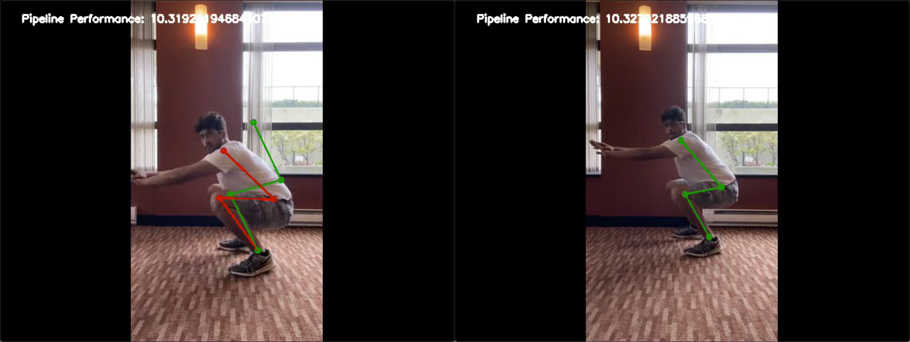
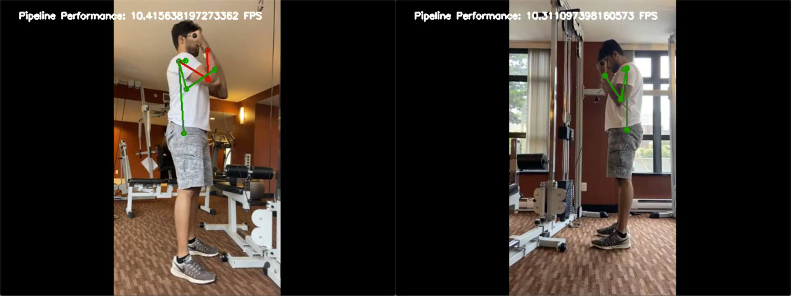
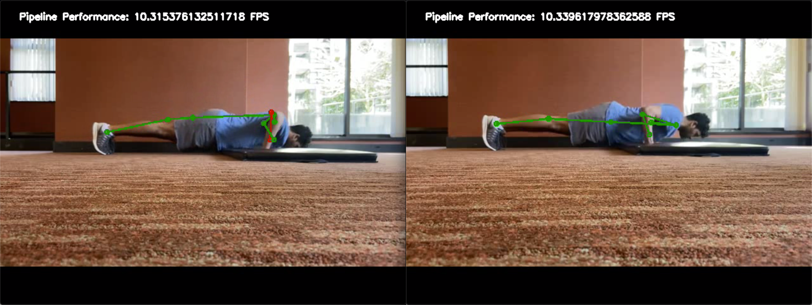
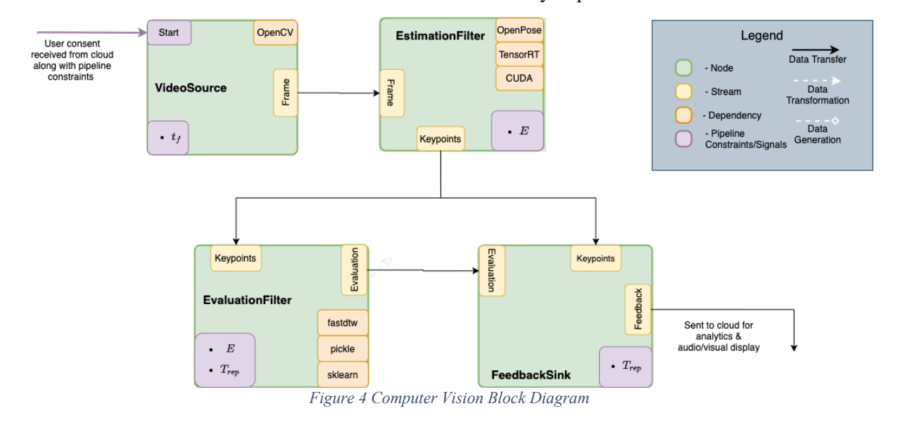

# valens-cv
Computer vision module for valens - a smart gym mirror which provides real-time feedback on the performance of various exercises.

## Description

Real-time feedback is given to users as they perform an exercise by first drawing the user’s pose on top of their body.
The color of the user’s pose indicates the correctness of their form; if they have an incorrect form the pose is red, otherwise it is green. In addition,if the user has an incorrect form, then a corrective projection is also drawn in green on top of their current pose.
Some examples of feedback are show in the images below. The real-time performance of the overall system in annotated on the top in each of the examples.

*Visual feedback for incorrect and correct forms of a bodyweight squat.*

*Visual feedback for incorrect and correct forms of a bicep curl.*

*Visual feedback for incorrect and correct forms of a push-up.*

## Design
This module is designed as a pipeline of concurrent tasks, or nodes, which work together to provide feedbak to users in real-time. An overview of the software design is shown in the image below.

*System software design.*

Pose estimation is performed using [OpenPose](https://github.com/CMU-Perceptual-Computing-Lab/openpose).

## Examples
See `valens/examples` for example scripts which run different types of pipelines.
